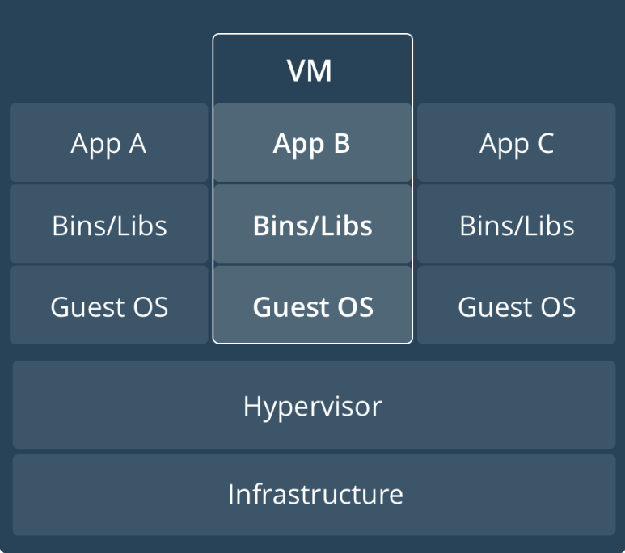
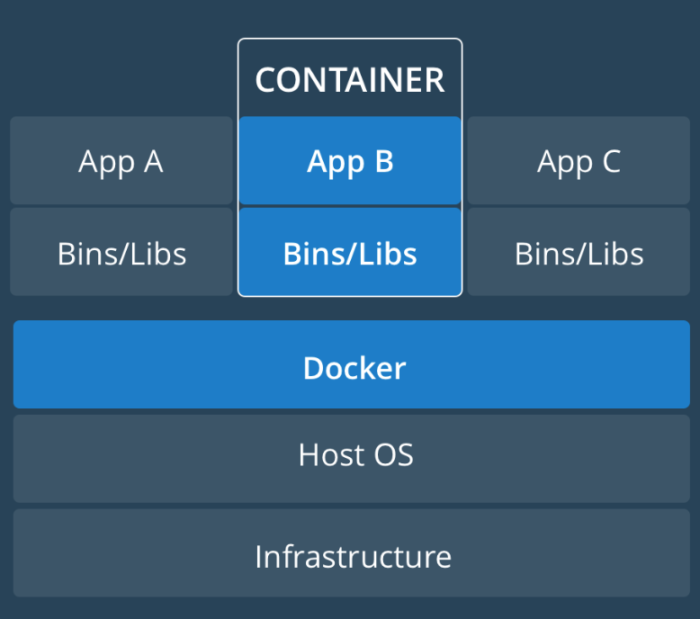
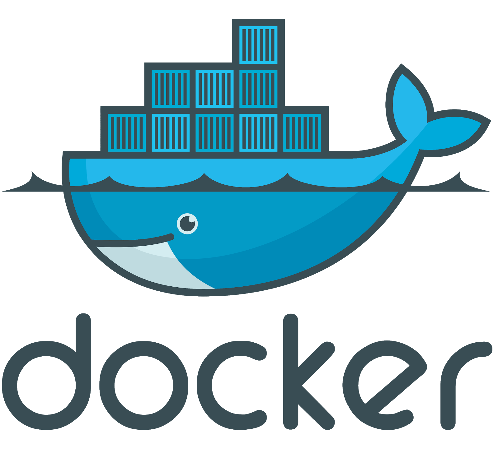

# What is DevOps? <!-- .slide: class="extly-slide-style plain" data-background="#ffa619" -->

 <!-- .element: style="width: 50%" -->

<!-- .element: class="small" --> [Illustration from Wikipedia](https://en.wikipedia.org/wiki/DevOps)

## What is DevOps? <!-- .slide: class="extly-slide-style plain" data-background="#ffa619" -->

 <!-- .element: style="width: 80%" -->

<!-- .element: class="small" --> [Illustration from Wikipedia](https://en.wikipedia.org/wiki/DevOps)

## What is CI/CD?

- **Continuous Integration** (CI)
  - Merge changes as often as possible
  - Changes are validated running automated tests "automated your testing"

## What is CI/CD?

- **Continuous Delivery**
  - "automated your release process"
  - Deploy by clicking on a button

## What is CI/CD?

- **Continuous Deployment** (CD)
  - Every change is released to your customers. _There's no human intervention._

## Real-world case

 <!-- .element: style="width: 80%" -->

<!-- .element: class="small" --> [J and Beyond 2016 - JED development: how to collaborate and improve our extensions directory](https://docs.google.com/presentation/d/1YTUvhYEK-bxoEE5-vJsjv06kZAvhpsAjSRmsY2w9GkU/edit#slide=id.g12f881336a_0_9)

## Real-world case

 <!-- .element: style="width: 80%" -->

<!-- .element: class="small" --> [J and Beyond 2016 - JED development: how to collaborate and improve our extensions directory](https://docs.google.com/presentation/d/1YTUvhYEK-bxoEE5-vJsjv06kZAvhpsAjSRmsY2w9GkU/edit#slide=id.g12f881336a_0_9)

## Back to the beginning <!-- .slide: class="extly-slide-style plain" data-background="#ffa619" -->

 <!-- .element: style="width: 80%" -->

Let's start with the development of the code base

# We need Containers

 <!-- .element: style="width: 70%" -->

<!-- .element: class="small" --> The use of standardized steel shipping containers began during the late 1940s [...](https://en.wikipedia.org/wiki/Intermodal_container#History)

## Virtual Machines

 <!-- .element: width="40%" -->

- Many “computers” running on a single computer
- Infrastructure can be shared
- Each “computer” is fully “isolated”

## Containers

 <!-- .element: width="40%" -->

- Many “computers” running on a single computer
- Infrastructure and some software can be shared
- Each “computer” is “sorta-isolated”

## Containers vs. VMs

- **Scale**: Run WAY more containers per infrastructure
- **Speed**: Start, stop, destroy in seconds vs minutes
- **Portability**: Run them anywhere and get parity (eg local)
- **Separation** of Concerns: **One service** per container

<!-- .element: class="small" --> For more information_ https://www.docker.com/what-container

## Docker Community Edition (CE) <!-- .slide: class="extly-slide-style plain" data-background="#ffa619" -->

 <!-- .element: width="40%" -->

- Container daemon and utility
- Client/Server model
- Dockerfiles

## A Dockerfile <!-- .slide: class="extly-slide-style plain console" -->

    FROM ubuntu:16.04
    MAINTAINER Fer Uria <fauria@gmail.com>
    LABEL Description="Cutting-edge LAMP stack, based on Ubuntu 16.04 LTS. Includes .htaccess support and popular PHP7 features, including composer and mail() function." \
      License="Apache License 2.0" \
      Usage="docker run -d -p [HOST WWW PORT NUMBER]:80 -p [HOST DB PORT NUMBER]:3306 -v [HOST WWW DOCUMENT ROOT]:/var/www/html -v [HOST DB DOCUMENT ROOT]:/var/lib/mysql fauria/lamp" \
      Version="1.0"

    RUN apt-get update
    RUN apt-get upgrade -y

    COPY debconf.selections /tmp/
    RUN debconf-set-selections /tmp/debconf.selections

    RUN apt-get install -y zip unzip
    RUN apt-get install -y \
      php7.0 \
      php7.0-bz2 \
      php7.0-cgi \
      php7.0-cli \
      php7.0-common \
      php7.0-curl \
      php7.0-dev \
      php7.0-enchant \
      php7.0-fpm \
      php7.0-gd \
      php7.0-gmp \
      php7.0-imap \
      php7.0-interbase \
      php7.0-intl \
      php7.0-json \
      php7.0-ldap \
      php7.0-mbstring \
      php7.0-mcrypt \
      php7.0-mysql \
      php7.0-odbc \
      php7.0-opcache \
      php7.0-pgsql \
      php7.0-phpdbg \
      php7.0-pspell \
      php7.0-readline \
      php7.0-recode \
      php7.0-snmp \
      php7.0-sqlite3 \
      php7.0-sybase \
      php7.0-tidy \
      php7.0-xmlrpc \
      php7.0-xsl \
      php7.0-zip
    RUN apt-get install apache2 libapache2-mod-php7.0 -y
    RUN apt-get install mariadb-common mariadb-server mariadb-client -y
    RUN apt-get install postfix -y
    RUN apt-get install git nodejs npm composer nano tree vim curl ftp -y
    RUN npm install -g bower grunt-cli gulp

    ENV LOG_STDOUT **Boolean**
    ENV LOG_STDERR **Boolean**
    ENV LOG_LEVEL warn
    ENV ALLOW_OVERRIDE All
    ENV DATE_TIMEZONE UTC
    ENV TERM dumb

    COPY index.php /var/www/html/
    COPY run-lamp.sh /usr/sbin/

    RUN a2enmod rewrite
    RUN ln -s /usr/bin/nodejs /usr/bin/node
    RUN chmod +x /usr/sbin/run-lamp.sh
    RUN chown -R www-data:www-data /var/www/html

    VOLUME /var/www/html
    VOLUME /var/log/httpd
    VOLUME /var/lib/mysql
    VOLUME /var/log/mysql

    EXPOSE 80
    EXPOSE 3306

    CMD ["/usr/sbin/run-lamp.sh"]

<!-- .element: class="small" --> By [fauria/lamp](https://github.com/fauria/docker-lamp)

## Docker Compose <!-- .slide: class="extly-slide-style plain" data-background="#ffa619" -->

 <!-- .element: width="40%" -->

- Container Orchestation
- First level of abstraction
- docker-compose.yml

## docker-compose.yml <!-- .slide: class="extly-slide-style plain console" -->

    version: "3"

    services:
      webserver:
        build:
          context: ./bin/webserver
        container_name: 'tnb-webserver'
        restart: 'always'
        ports:
          - "80:80"
          - "443:443"
        links:
          - mysql
        volumes:
          - ${DOCUMENT_ROOT-./www}:/var/www/html
          - ${PHP_INI-./config/php/php.ini}:/usr/local/etc/php/php.ini
          - ${VHOSTS_DIR-./config/vhosts}:/etc/apache2/sites-enabled
          - ${LOG_DIR-./logs/apache2}:/var/log/apache2
      mysql:
        build: ./bin/mysql
        container_name: 'tnb-mysql'
        restart: 'always'
        ports:
          - "3306:3306"
        volumes:
          - ${MYSQL_DATA_DIR-./data/mysql}:/var/lib/mysql
          - ${MYSQL_LOG_DIR-./logs/mysql}:/var/log/mysql
        environment:
          MYSQL_ROOT_PASSWORD: tiger
          MYSQL_DATABASE: tnb
          MYSQL_USER: tnb
          MYSQL_PASSWORD: tnb
      phpmyadmin:
        image: phpmyadmin/phpmyadmin
        container_name: 'tnb-phpmyadmin'
        links:
          - mysql
        environment:
          PMA_HOST: mysql
          PMA_PORT: 3306
        ports:
          - '8080:80'
        volumes:
          - /sessions

<!-- .element: class="small" --> By [pnglabz/docker-compose-lamp](https://github.com/pnglabz/docker-compose-lamp)

## What is Lando? <!-- .slide: class="extly-slide-style plain" -->

## Lando is a CLI for devs  <!-- .slide: class="extly-slide-style plain" data-background-repeat="no-repeat" data-background-image="images/10-what/lando-seal.png" data-background-size="15%" data-background-position="95% 5%" -->

    anibal@local-server:~/$ lando start

- Quickly &amp; painlessly spin up the services
- Local development environment
- DevOps tool built on Docker containers
- It's a free, open source, and cross-platform

## A developer should be able to <!-- .slide: class="extly-slide-style plain" data-background-repeat="no-repeat" data-background-image="images/10-what/lando-seal.png" data-background-size="15%" data-background-position="95% 5%" -->

<!-- .element: class="small" --> Get a running site and the tools needed to develop with:

- a **single**, **short** config file called `.lando.yml` and,
- a few `lando` commands.

## A developer should be able to <!-- .slide: class="extly-slide-style plain" data-background-repeat="no-repeat" data-background-image="images/10-what/lando-seal.png" data-background-size="15%" data-background-position="95% 5%" -->

- git clone
- **lando start**
- ... and get EVERYTHING they need to develop

## First Recipe <!-- .slide: class="extly-slide-style plain console" -->

    ##
    # My First Recipe
    # .lando.yml
    #
    name: mysite
    recipe: lamp

- Linux
- Apache
- MySQL
- PHP

## lando start <!-- .slide: class="extly-slide-style plain console" -->

    anibal@local-server:~/$ lando start

    landoproxyhyperion5000gandalfedition_proxy_1 is up-to-date
    Creating network "mysite_default" with the default driver
    Creating volume "mysite_data" with default driver
    Creating volume "mysite_appserver" with default driver
    Creating volume "mysite_data_database" with default driver
    Creating mysite_database_1  ... done
    Creating mysite_appserver_1 ... done
    Waiting until database service is ready...

    BOOMSHAKALAKA!!!

    Your app has started up correctly.
    Here are some vitals:

    NAME            mysite
    LOCATION        /home/anibal
    SERVICES        appserver, database
    APPSERVER URLS  https://localhost:32813
                    http://localhost:32814
                    http://mysite.lndo.site

## This presentation <!-- .slide: class="extly-slide-style plain console" -->

Developed with [reveal.js](https://github.com/hakimel/reveal.js).

    ##
    # The Recipe of this Presentation
    # .lando.yml
    #
    name: devops-with-lando-and-docker

    proxy:
      html:
        - devops-with-lando-and-docker.lndo.site
    services:
      html:
        type: apache:2.2
        webroot: web
        overrides:
          services:
            ports:
              - '8080:80'

<!-- .element: class="small" --><https://github.com/anibalsanchez/devops-with-lando-and-docker>

## This presentation - lando start <!-- .slide: class="extly-slide-style plain console" -->

    anibal@local-server:~/devops-with-lando-and-docker$ lando start

    landoproxyhyperion5000gandalfedition_proxy_1 is up-to-date
    Starting devopswithlandoanddocker_html_1 ... done
    Waiting until html service is ready...

    BOOMSHAKALAKA!!!

    Your app has started up correctly.
    Here are some vitals:

    NAME       devops-with-lando-and-docker
    LOCATION   /home/anibal/devops-with-lando-and-docker
    SERVICES   html
    HTML URLS  http://localhost:8080
               http://localhost:32818
               http://devops-with-lando-and-docker.lndo.site
               https://devops-with-lando-and-docker.lndo.site

<!-- .element: class="small" --><https://github.com/anibalsanchez/devops-with-lando-and-docker>

## Lando - [System Requirements](https://docs.devwithlando.io/installation/system-requirements.html)

- Supported platforms: macOS, Windows and Linux
- [Docker Community Edition](https://docs.docker.com/engine/installation/)
  - [Docker for Ubuntu](https://www.docker.com/docker-ubuntu)
  - <https://get.docker.com>

### Lando - Installation

- [How to install Lando](https://docs.devwithlando.io/installation/installing.html) - <https://docs.devwithlando.io>
