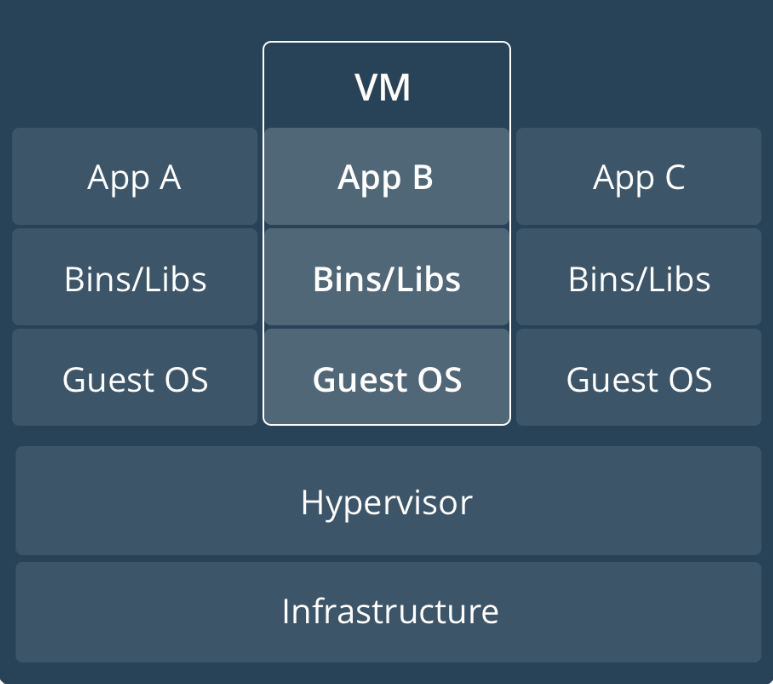
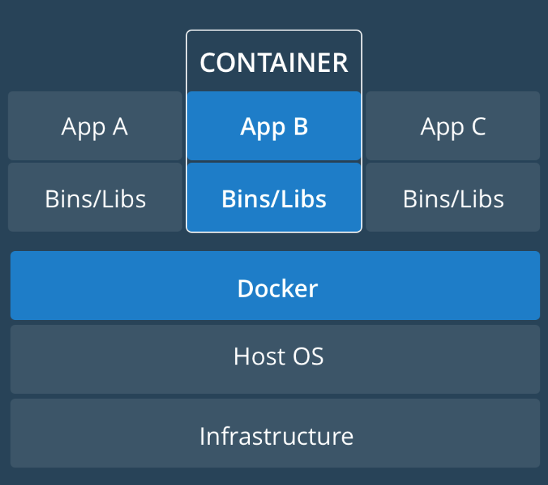
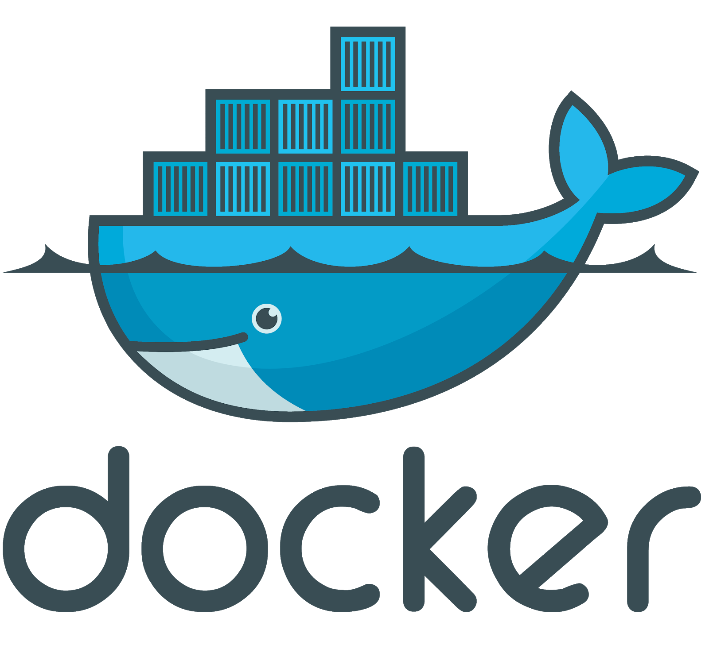

# Lando is powered by Docker

Intro to Containers, Docker, Docker Compose

## Virtual Machines

 <!-- .element: width="40%" -->

- Many “computers” running on a single computer
- Infrastructure can be shared
- Each “computer” is fully “isolated”

## Containers

 <!-- .element: width="40%" -->

- Many “computers” running on a single computer
- Infrastructure and some software can be shared
- Each “computer” is “sorta-isolated”

## Containers vs. VMs

- **Scale**: Run WAY more containers per infrastructure
- **Speed**: Start, stop, destroy in seconds vs minutes
- **Portability**: Run them anywhere and get parity (eg local)
- **Separation** of Concerns: One service per container

<!-- .element: class="small" --> For more information_ https://www.docker.com/what-container

## Docker (Engine)

 <!-- .element: width="40%" -->

- Container daemon and utility
- Client/Server model
- Dockerfiles

## A Dockerfile <!-- .slide: class="extly-slide-style plain console" -->

    FROM ubuntu:16.04
    MAINTAINER Fer Uria <fauria@gmail.com>
    LABEL Description="Cutting-edge LAMP stack, based on Ubuntu 16.04 LTS. Includes .htaccess support and popular PHP7 features, including composer and mail() function." \
      License="Apache License 2.0" \
      Usage="docker run -d -p [HOST WWW PORT NUMBER]:80 -p [HOST DB PORT NUMBER]:3306 -v [HOST WWW DOCUMENT ROOT]:/var/www/html -v [HOST DB DOCUMENT ROOT]:/var/lib/mysql fauria/lamp" \
      Version="1.0"

    RUN apt-get update
    RUN apt-get upgrade -y

    COPY debconf.selections /tmp/
    RUN debconf-set-selections /tmp/debconf.selections

    RUN apt-get install -y zip unzip
    RUN apt-get install -y \
      php7.0 \
      php7.0-bz2 \
      php7.0-cgi \
      php7.0-cli \
      php7.0-common \
      php7.0-curl \
      php7.0-dev \
      php7.0-enchant \
      php7.0-fpm \
      php7.0-gd \
      php7.0-gmp \
      php7.0-imap \
      php7.0-interbase \
      php7.0-intl \
      php7.0-json \
      php7.0-ldap \
      php7.0-mbstring \
      php7.0-mcrypt \
      php7.0-mysql \
      php7.0-odbc \
      php7.0-opcache \
      php7.0-pgsql \
      php7.0-phpdbg \
      php7.0-pspell \
      php7.0-readline \
      php7.0-recode \
      php7.0-snmp \
      php7.0-sqlite3 \
      php7.0-sybase \
      php7.0-tidy \
      php7.0-xmlrpc \
      php7.0-xsl \
      php7.0-zip
    RUN apt-get install apache2 libapache2-mod-php7.0 -y
    RUN apt-get install mariadb-common mariadb-server mariadb-client -y
    RUN apt-get install postfix -y
    RUN apt-get install git nodejs npm composer nano tree vim curl ftp -y
    RUN npm install -g bower grunt-cli gulp

    ENV LOG_STDOUT **Boolean**
    ENV LOG_STDERR **Boolean**
    ENV LOG_LEVEL warn
    ENV ALLOW_OVERRIDE All
    ENV DATE_TIMEZONE UTC
    ENV TERM dumb

    COPY index.php /var/www/html/
    COPY run-lamp.sh /usr/sbin/

    RUN a2enmod rewrite
    RUN ln -s /usr/bin/nodejs /usr/bin/node
    RUN chmod +x /usr/sbin/run-lamp.sh
    RUN chown -R www-data:www-data /var/www/html

    VOLUME /var/www/html
    VOLUME /var/log/httpd
    VOLUME /var/lib/mysql
    VOLUME /var/log/mysql

    EXPOSE 80
    EXPOSE 3306

    CMD ["/usr/sbin/run-lamp.sh"]

<!-- .element: class="small" --> By [fauria/lamp](https://github.com/fauria/docker-lamp)

## Docker Compose

 <!-- .element: width="40%" -->

- Container Orchestation
- First level of abstraction
- docker-compose.yml

## docker-compose.yml <!-- .slide: class="extly-slide-style plain console" -->

    version: "3"

    services:
      webserver:
        build:
          context: ./bin/webserver
        container_name: 'tnb-webserver'
        restart: 'always'
        ports:
          - "80:80"
          - "443:443"
        links:
          - mysql
        volumes:
          - ${DOCUMENT_ROOT-./www}:/var/www/html
          - ${PHP_INI-./config/php/php.ini}:/usr/local/etc/php/php.ini
          - ${VHOSTS_DIR-./config/vhosts}:/etc/apache2/sites-enabled
          - ${LOG_DIR-./logs/apache2}:/var/log/apache2
      mysql:
        build: ./bin/mysql
        container_name: 'tnb-mysql'
        restart: 'always'
        ports:
          - "3306:3306"
        volumes:
          - ${MYSQL_DATA_DIR-./data/mysql}:/var/lib/mysql
          - ${MYSQL_LOG_DIR-./logs/mysql}:/var/log/mysql
        environment:
          MYSQL_ROOT_PASSWORD: tiger
          MYSQL_DATABASE: tnb
          MYSQL_USER: tnb
          MYSQL_PASSWORD: tnb
      phpmyadmin:
        image: phpmyadmin/phpmyadmin
        container_name: 'tnb-phpmyadmin'
        links:
          - mysql
        environment:
          PMA_HOST: mysql
          PMA_PORT: 3306
        ports:
          - '8080:80'
        volumes:
          - /sessions

<!-- .element: class="small" --> By [pnglabz/docker-compose-lamp](https://github.com/pnglabz/docker-compose-lamp)

## Lando Abstractions <!-- .slide: class="extly-slide-style plain" data-background-repeat="no-repeat" data-background-image="images/10-what/lando-seal.png" data-background-size="15%" data-background-position="95% 5%" -->

- A higher level of abstraction
- Docker Compose compatible syntaxis
- Devwithlando images
- Recipes and sensible default values
  - Services
  - Proxy Routes
  - Events
  - Tooling

## Revisiting the First Recipe <!-- .slide: class="extly-slide-style plain console" -->

    ##
    # My First Recipe
    # .lando.yml
    #
    name: mysite
    recipe: lamp

## First Recipe - Internals <!-- .slide: class="extly-slide-style plain console" -->

<!-- .element: class="small" --> **Hidden docker-compose.yml**: ~/.lando/compose/mysite/mysite-1.yml

    version: '3.2'
    services:
      appserver:
        image: 'devwithlando/php:7.1-apache'
        environment:
          TERM: xterm
          COMPOSER_ALLOW_SUPERUSER: 1
          PATH: >-
            /usr/local/sbin:/usr/local/bin:/usr/sbin:/usr/bin:/sbin:/bin:/var/www/.composer/vendor/bin
          LANDO_WEBROOT: /app
          LANDO_SERVICE_NAME: appserver
          LANDO_SERVICE_TYPE: php
          LANDO_MOUNT: /app
          DB_HOST: database
          DB_USER: lamp
          DB_PASSWORD: lamp
          DB_NAME: lamp
          DB_PORT: 3306
          COLUMNS: 256
          LANDO: 'ON'
          LANDO_CONFIG_DIR: /home/anibal/.lando
          LANDO_APP_NAME: mysite
          LANDO_APP_ROOT: /home/anibal/TEMP/U
          LANDO_APP_ROOT_BIND: /home/anibal/TEMP/U
          LANDO_HOST_OS: linux
          LANDO_HOST_UID: '1000'
          LANDO_HOST_GID: '1000'
          LANDO_HOST_IP: 192.168.23.100
          LANDO_WEBROOT_USER: www-data
          LANDO_WEBROOT_GROUP: www-data
          LANDO_WEBROOT_UID: '33'
          LANDO_WEBROOT_GID: '33'
        ports:
          - '80'
          - '443'
        volumes:
          - /var/www/.composer
          - /usr/local/bin
          - >-
            /home/anibal/.lando/services/config/php/php.ini:/usr/local/etc/php/conf.d/xxx-lando-default.ini
          - '/home/anibal/.lando/engine/scripts/add-cert.sh:/scripts/add-cert.sh'
          - >-
            /home/anibal/.lando/services/config/php/httpd-ssl.conf:/etc/apache2/sites-enabled/000-default.conf
          - >-
            /home/anibal/.lando/engine/scripts/lando-entrypoint.sh:/lando-entrypoint.sh
          - '$LANDO_APP_ROOT_BIND:/app'
          - '$LANDO_ENGINE_HOME:/user'
          - '$LANDO_ENGINE_CONF:/lando'
          - '/home/anibal/.lando/engine/scripts/user-perms.sh:/helpers/user-perms.sh'
          - '/home/anibal/.lando/engine/scripts/load-keys.sh:/scripts/load-keys.sh'
          - >-
            /home/anibal/.lando/services/helpers/mysql-import.sh:/helpers/mysql-import.sh
          - >-
            /home/anibal/.lando/services/helpers/mysql-export.sh:/helpers/mysql-export.sh
        command: docker-php-entrypoint sh -c 'a2enmod rewrite && apache2-foreground'
        entrypoint: /lando-entrypoint.sh
        networks:
          default: {}
        labels:
          io.lando.container: 'TRUE'
          io.lando.id: d1db68d981e28ba92f9a5e9b7a920bc800c188a5
      database:
        image: 'mysql:latest'
        environment:
          MYSQL_USER: lamp
          MYSQL_PASSWORD: lamp
          MYSQL_ALLOW_EMPTY_PASSWORD: 'yes'
          MYSQL_DATABASE: lamp
          TERM: xterm
          LANDO_SERVICE_NAME: database
          LANDO_SERVICE_TYPE: mysql
          LANDO_MOUNT: /app
          COLUMNS: 256
          LANDO: 'ON'
          LANDO_CONFIG_DIR: /home/anibal/.lando
          LANDO_APP_NAME: mysite
          LANDO_APP_ROOT: /home/anibal/TEMP/U
          LANDO_APP_ROOT_BIND: /home/anibal/TEMP/U
          LANDO_HOST_OS: linux
          LANDO_HOST_UID: '1000'
          LANDO_HOST_GID: '1000'
          LANDO_HOST_IP: 192.168.23.100
          LANDO_WEBROOT_USER: www-data
          LANDO_WEBROOT_GROUP: www-data
          LANDO_WEBROOT_UID: '33'
          LANDO_WEBROOT_GID: '33'
        volumes:
          - 'data_database:/var/lib/mysql'
          - >-
            /home/anibal/.lando/engine/scripts/lando-entrypoint.sh:/lando-entrypoint.sh
          - '$LANDO_APP_ROOT_BIND:/app'
          - '$LANDO_ENGINE_HOME:/user'
          - '$LANDO_ENGINE_CONF:/lando'
          - '/home/anibal/.lando/engine/scripts/user-perms.sh:/helpers/user-perms.sh'
          - '/home/anibal/.lando/engine/scripts/load-keys.sh:/scripts/load-keys.sh'
          - >-
            /home/anibal/.lando/services/helpers/mysql-import.sh:/helpers/mysql-import.sh
          - >-
            /home/anibal/.lando/services/helpers/mysql-export.sh:/helpers/mysql-export.sh
        healthcheck:
          test: mysql -uroot --silent --execute "SHOW DATABASES;"
          interval: 2s
          timeout: 10s
          retries: 25
        command: docker-entrypoint.sh mysqld
        ports:
          - '3306'
        entrypoint: /lando-entrypoint.sh
        networks:
          default: {}
        labels:
          io.lando.container: 'TRUE'
          io.lando.id: d1db68d981e28ba92f9a5e9b7a920bc800c188a5
    volumes:
      data: {}
      appserver: {}
      data_database: {}
    networks: {}

## Useful snippets - Proxy route <!-- .slide: class="extly-slide-style plain console" -->

    proxy:
      html:
        - mysite.lndo.site

## Useful snippets - localhost:8080 <!-- .slide: class="extly-slide-style plain console" -->

    overrides:
      services:
        ports:
          # A nice local site http://localhost:8080
          - '8080:80

## Useful snippets - Testing MySQL 8 <!-- .slide: class="extly-slide-style plain console" -->

    database:
      type: mysql
      overrides:
        services:
          image: 'mysql:8'

## Useful snippets - Load a custom php.ini <!-- .slide: class="extly-slide-style plain console" -->

    services:
      appserver:
        config:
          conf: config/php.ini

## Useful services

    pma:
      type: phpmyadmin

    mailhog:
      type: mailhog

## Flexible Tooling - Joomla

    tooling:
      mysql:
        user: root
        service: database
        description: Drop into a MySQL shell

      j-install:
        service: appserver
        description: "Command to install Joomla."
        cmd: echo Installing Joomla ...

      j-dev:
        service: appserver
        description: "Apply my default configuration for JDevelopment"
        cmd: echo Configuring my defaults in configuration.php for JDevelopment…

    events:
      post-j-install:
        - appserver: curl -L https://downloads.joomla.org/cms/joomla3/3-8-6/Joomla_3-8-7-Stable-Full_Package.tar.gz | tar zxv -C $LANDO_WEBROOT

      post-j-dev:
          - appserver: test -e $LANDO_MOUNT/www/configuration.php && sh $LANDO_MOUNT/config/j-dev.sh

## Flexible Tooling - WordPress

    tooling:
      wp-install:
        service: appserver
        description: "Command to install WordPress."
        cmd: echo Installing WordPress ...

    events:
      post-wp-install:
      ## Download WordPress
      - appserver: cd $LANDO_WEBROOT; wp core download
      ## Configure it
      - appserver: cd $LANDO_WEBROOT; wp core config --dbname=wp_tpldb --dbuser=wp_tpldb --dbpass=wp_tpldb --dbhost=database --dbprefix=wp_
      ## Install it
      - appserver: cd $LANDO_WEBROOT; wp core install --url="http://localhost:8080" --title="Blog Title" --admin_user="admin" --admin_password="admin" --admin_email="anibal.sanchez@extly.com"
      ## Install Gutenberg plugin
      - appserver: cd $LANDO_WEBROOT; wp plugin install gutenberg --activate
